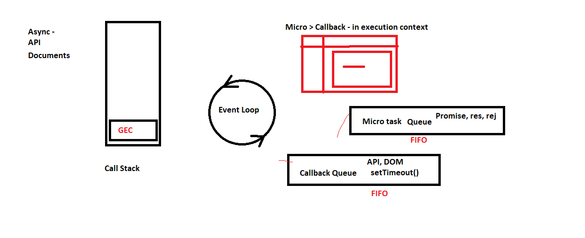

# Day-2 JS Quesions

## Q-1 What is execution context?
- When the JavaScript engine scans a script file, it makes an environment called the Execution Context that handles the entire transformation and execution of the code. 

- This is for Synchronous JavaScript
    1. Global Execution Context
    2. Function Execution context
    3. Memory Allocation
    4. Code Execution 
    5. Call Stack
    ---
    ## Q-2 What is an event loop and call stack?
- Asynchronous JavaScript
1. Event Loop
    - Event loop in JavaScript is a mechanism through which the 'calls waiting for execution' in the callback queue/job queue can be put on the call stack. For any event from the callback queue/job queue to come to call stack, the call stack will have to be empty.

2. Callback queue

    - A callback queue is a queue of tasks that are executed after the current task. The callback queue is handled by the JavaScript engine after it has executed all tasks in the microtask queue.
    - A Microtask queue is a queue of tasks that are executed after the current task. The microtask queue is handled by the JavaScript engine before it moves on to the next task in the callback queue.

3. Call Stack
    - A JavaScript call stack is an example of a stack data structure. In a JS call stack, the elements are function invocations. Every time you invoke a function, it's added to the stack. 
    


---

## Q3 What is creation phase and execution phase?
- The creation phase includes creating the global and function execution contexts, creating the scope chain, and allocating memories for the variables and functions. During the execution phase, the JavaScript engine executes the code line by line. This includes evaluating and executing statements.

## Q4 What is the spread operator?
- The JavaScript spread operator ( ... ) allows us to quickly copy all or part of an existing array or object into another array or object.
```bash
const arr = [2,3,4,5,6,7,8,9];
const arr = [10,11,12];

    console.log(...arr);
    
    const arr2 = [...arr, ...arr1]
    console.log(arr2);
    
    
// Spread Operator - Function

const arr1 = [1,11, 12, 10]

function Sum(a, b, c){
    console.log(a, b, c);
    return a + b + c;
}

console.log(Sum(...arr1));

//Spread Operator - Object

const Obj1 = {
    name : "Dabloo",
    Age : 23
}

const Obj2 = {
    Course : "MERN",
    ...Obj1
}

console.log(Obj1);
console.log(Obj2);


```
---
## Q-5 What is the use of setTimeout?
- The global setTimeout() method sets a timer which executes a function or specified piece of code once the timer expires.

// setTimeout(() => {
    
// }, 1000);
```bash
// settimeout working as a setinterval

function display(){
    let time = new Date()
    let hr= time.toLocaleTimeString()
    console.log(hr)
    setTimeout(()=>{
display()
 },1000 )
}
display()

```
```bash
//Example of setInterval

function Display(){
    let time = new Date();

    let hr = time.toLocaleTimeString();

    console.log(hr);
}

setInterval(() => {
    Display();
}, 2000);
```
---

## Q-6 What are callbacks?
- A callback is a function passed as an argument to another function. Using a callback, you could call the calculator function.

```bash
Callback function

function greet(name, func){
    console.log(`Hi ${name}`);

    console.log(func());
}

function Sum(){
    console.log("Hey....");
}

greet('EA23', Sum())

greet('EA23', Sum)
```
---

## Q-7 What is callback hell?
- The phenomenon which happens when we nest multiple callbacks within a function is called a callback hell. The shape of the resulting code structure resembles a pyramid and hence callback hell is also called the “pyramid of the doom”.

```bash
function op1(callback){
    setTimeout(()=>{
        console.log("hii")
        callback()
    },1000)
}
function op2(callback){
    setTimeout(()=>{
        console.log("hello")
        callback()
    },1000)
}
function op3(callback){
    setTimeout(()=>{
        console.log("hey")
        callback()
    },1000)
}
op1(()=>{
    op2(()=>{
        op3(()=>{
            console.log("done")
        })
    })
})
```
---
## Q-8 Difference between undefined vs not defined vs NaN?
- undefined - when the variable is declared but not intialized, like it is empty variable or doesnot have value.
```bash
var a= 
console.log(a)// a is undefined
//value is not initializes
```
- not defined - When the variable is not declared or exist.
```bash
var a= 10
console.log(b)// b is not defined
//variable does not exist
``` 
- NaN - NaN means the value is Not A Number. Null is a value which you can use when you yourself want assign a empty value to a variable. 

```bash

let a =10
let b ="John"

console.log(a-b)// NaN
//b is not a number
```
